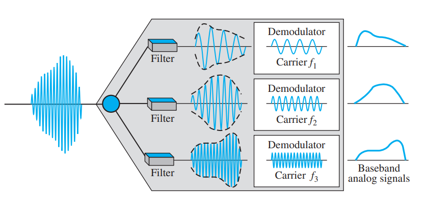

```{r knitr_init, echo=FALSE, error=FALSE, message=FALSE, warning=FALSE, cache=FALSE}
library(knitr)
library(highcharter)
library(rmdformats)
library(magrittr)
library(gsignal)
## Global options
options(max.print="75")
opts_chunk$set(echo=TRUE,
	             cache=TRUE,
               prompt=FALSE,
               tidy=TRUE,
               comment=NA,
               message=FALSE,
               warning=FALSE)
opts_knit$set(width=75)
```

En el receptor se tiene el siguiente diagrama. El cual consta de 


    
    
# Práctica:

Multiplexar las siguientes señales:

- $\cos(10\pi t)$
- $\cos(20\pi t)$
- $\frac{4}{\pi}\sin(6\pi t) + \frac{1}{3}\sin(18\pi t)$


### - $\cos(10\pi t)$

Se tiene la señal:
```{r FDM}
x   <- seq(0,1, length=1000)
ft  <- 1.5*cos(4*pi*x)+ 0.3*sin(8*pi*x)+0.3*cos(14*pi*x)
ca  <- cos(10*pi*x)
FDM  <- ft*ca
highchart() %>% hc_add_series(cbind(x,ft), name="Información") %>% hc_title(text="\\(f(t) = 3/2\\cos(4\\pi t)+1/3\\sin(6\\pi t)+1/3\\cos(14\\pi t)\\)", useHTML=T) %>% hc_add_theme(hc_theme_db()) %>% hc_xAxis(title=list(text="Tiempo")) %>% hc_yAxis(title = list(text="Valores", useHTML=T), min=-1.3, max = 1.3, allowDecimal = T) %>% hc_chart(zoomType="xy") %>% hc_add_series(cbind(x,FDM), name="FDM") %>% hc_add_series(cbind(x,ft), type= "line", dashStyle = "Dash", name="Envelope", color = "#ffb703") %>% hc_add_series(cbind(x,-ft), type= "line", dashStyle = "Dash", name="Envelope", color = "#ffb703")
```

- Modulación:

```{r}
t   <- seq(0,1, length=1000)
inf  <- 1.5*cos(4*pi*t)+ 0.3*sin(8*pi*t)+0.3*cos(14*pi*t)
crr  <- cos(10*pi*t)
FDM  <- inf*crr
demFDM <- FDM*crr
highchart() %>% hc_add_series(cbind(t,demFDM), name="FDM-DEM") %>% hc_add_series(cbind(t, inf), dashStyle = "Dash", name="Información", color = "#ffb703") %>%  hc_title(text="Modulación FDM de una señal FDM", useHTML=T) %>% hc_add_theme(hc_theme_db()) %>% hc_xAxis(title=list(text="Tiempo")) %>% hc_yAxis(title = list(text="Valores", useHTML=T), min=-1.8, max = 1.8, allowDecimal = T) %>% hc_chart(zoomType="xy")
```

- Demodulación:

```{r}
library(highcharter)
library(gsignal)
x   <- seq(0,1, length=1000)
ft  <- 1.5*cos(4*pi*x)+ 0.3*sin(8*pi*x)+0.3*cos(14*pi*x)
ca  <- cos(10*pi*x)
FDM  <- ft*ca
demFDM <- FDM*ca
fil   <- butter(4, 0.02)
recv  <- filter(fil, demFDM)
highchart() %>% hc_add_series(cbind(x,ft), name="Original") %>% hc_add_series(cbind(x, recv), name="Recibida", color = "#ffb703") %>%  hc_title(text="Demodulación FDM", useHTML=T) %>% hc_add_theme(hc_theme_538()) %>% hc_xAxis(title=list(text="Tiempo")) %>% hc_yAxis(title = list(text="Valores", useHTML=T), min=-1.8, max = 1.8, allowDecimal = T) %>% hc_chart(zoomType="xy")
```


### - $\cos(20\pi t)$

Se tiene la señal:

```{r}
x   <- seq(0,1, length=1000)
ft  <- 1.5*cos(4*pi*x)+ 0.3*sin(8*pi*x)+0.3*cos(14*pi*x)
ca  <- cos(20*pi*x)
FDM  <- ft*ca
highchart() %>% hc_add_series(cbind(x,ft), name="Información") %>% hc_title(text="\\(f(t) = 3/2\\cos(4\\pi t)+1/3\\sin(6\\pi t)+1/3\\cos(14\\pi t)\\)", useHTML=T) %>% hc_add_theme(hc_theme_db()) %>% hc_xAxis(title=list(text="Tiempo")) %>% hc_yAxis(title = list(text="Valores", useHTML=T), min=-1.3, max = 1.3, allowDecimal = T) %>% hc_chart(zoomType="xy") %>% hc_add_series(cbind(x,FDM), name="FDM") %>% hc_add_series(cbind(x,ft), type= "line", dashStyle = "Dash", name="Envelope", color = "#ffb703") %>% hc_add_series(cbind(x,-ft), type= "line", dashStyle = "Dash", name="Envelope", color = "#ffb703")
```


- Modulación:

```{r}
t   <- seq(0,1, length=1000)
inf  <- 1.5*cos(4*pi*t)+ 0.3*sin(8*pi*t)+0.3*cos(14*pi*t)
crr  <- cos(20*pi*t)
FDM  <- inf*crr
demFDM <- FDM*crr
highchart() %>% hc_add_series(cbind(t,demFDM), name="FDM-DEM") %>% hc_add_series(cbind(t, inf), dashStyle = "Dash", name="Información", color = "#ffb703") %>%  hc_title(text="Modulación FDM de una señal FDM", useHTML=T) %>% hc_add_theme(hc_theme_db()) %>% hc_xAxis(title=list(text="Tiempo")) %>% hc_yAxis(title = list(text="Valores", useHTML=T), min=-1.8, max = 1.8, allowDecimal = T) %>% hc_chart(zoomType="xy")
```

- Demodulación:

```{r}
library(highcharter)
library(gsignal)
x   <- seq(0,1, length=1000)
ft  <- 1.5*cos(4*pi*x)+ 0.3*sin(8*pi*x)+0.3*cos(14*pi*x)
ca  <- cos(20*pi*x)
FDM  <- ft*ca
demFDM <- FDM*ca
fil   <- butter(4, 0.02)
recv  <- filter(fil, demFDM)
highchart() %>% hc_add_series(cbind(x,ft), name="Original") %>% hc_add_series(cbind(x, recv), name="Recibida", color = "#ffb703") %>%  hc_title(text="Demodulación FDM", useHTML=T) %>% hc_add_theme(hc_theme_538()) %>% hc_xAxis(title=list(text="Tiempo")) %>% hc_yAxis(title = list(text="Valores", useHTML=T), min=-1.8, max = 1.8, allowDecimal = T) %>% hc_chart(zoomType="xy")
```


  
### - $\frac{4}{\pi}\sin(6\pi t) + \frac{1}{3}\sin(18\pi t)$

Se tiene la señal:
```{r}
x   <- seq(0,1, length=1000)
ft  <- 1.5*cos(4*pi*x)+ 0.3*sin(8*pi*x)+0.3*cos(14*pi*x)
ca  <- (4/pi) * sin(6 * pi * x) + (1/3) * sin(18 * pi * x)
FDM  <- ft*ca
highchart() %>% hc_add_series(cbind(x,ft), name="Información") %>% hc_title(text="\\(f(t) = 3/2\\cos(4\\pi t)+1/3\\sin(6\\pi t)+1/3\\cos(14\\pi t)\\)", useHTML=T) %>% hc_add_theme(hc_theme_db()) %>% hc_xAxis(title=list(text="Tiempo")) %>% hc_yAxis(title = list(text="Valores", useHTML=T), min=-1.3, max = 1.3, allowDecimal = T) %>% hc_chart(zoomType="xy") %>% hc_add_series(cbind(x,FDM), name="FDM") %>% hc_add_series(cbind(x,ft), type= "line", dashStyle = "Dash", name="Envelope", color = "#ffb703") %>% hc_add_series(cbind(x,-ft), type= "line", dashStyle = "Dash", name="Envelope", color = "#ffb703")
```

- Modulación:
```{r}
t   <- seq(0,1, length=1000)
inf  <- 1.5*cos(4*pi*t)+ 0.3*sin(8*pi*t)+0.3*cos(14*pi*t)
crr  <- (4/pi) * sin(6 * pi * x) + (1/3) * sin(18 * pi * x)
FDM  <- inf*crr
demFDM <- FDM*crr
highchart() %>% hc_add_series(cbind(t,demFDM), name="FDM-DEM") %>% hc_add_series(cbind(t, inf), dashStyle = "Dash", name="Información", color = "#ffb703") %>%  hc_title(text="Modulación FDM de una señal FDM", useHTML=T) %>% hc_add_theme(hc_theme_db()) %>% hc_xAxis(title=list(text="Tiempo")) %>% hc_yAxis(title = list(text="Valores", useHTML=T), min=-1.8, max = 1.8, allowDecimal = T) %>% hc_chart(zoomType="xy")
```

- Demodulación:
```{r}
library(highcharter)
library(gsignal)
x   <- seq(0,1, length=1000)
ft  <- 1.5*cos(4*pi*x)+ 0.3*sin(8*pi*x)+0.3*cos(14*pi*x)
ca  <- (4/pi) * sin(6 * pi * x) + (1/3) * sin(18 * pi * x)
FDM  <- ft*ca
demFDM <- FDM*ca
fil   <- butter(4, 0.02)
recv  <- filter(fil, demFDM)
highchart() %>% hc_add_series(cbind(x,ft), name="Original") %>% hc_add_series(cbind(x, recv), name="Recibida", color = "#ffb703") %>%  hc_title(text="Demodulación FDM", useHTML=T) %>% hc_add_theme(hc_theme_538()) %>% hc_xAxis(title=list(text="Tiempo")) %>% hc_yAxis(title = list(text="Valores", useHTML=T), min=-1.8, max = 1.8, allowDecimal = T) %>% hc_chart(zoomType="xy")
```

